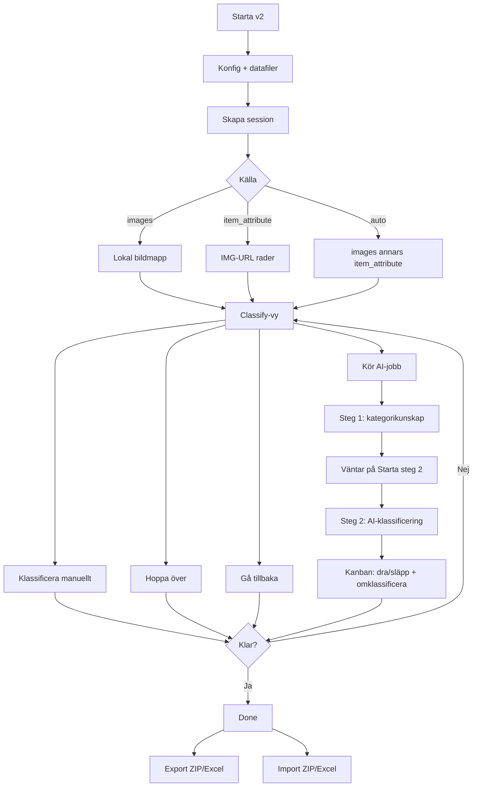

# Klassificering V2 Flöde

```mermaid
flowchart TD
  A[Starta v2] --> B[Konfig + datafiler]
  B --> C[Skapa session]
  C --> D{Källa}
  D -->|images| E[Lokal bildmapp]
  D -->|item_attribute| F[IMG-URL rader]
  D -->|auto| G[images annars item_attribute]
  E --> H[Classify-vy]
  F --> H
  G --> H

  H --> I[Klassificera manuellt]
  H --> J[Hoppa över]
  H --> K[Gå tillbaka]
  H --> L[Kör AI-jobb]

  L --> M[Steg 1: kategorikunskap]
  M --> N[Väntar på Starta steg 2]
  N --> O[Steg 2: AI-klassificering]
  O --> P[Kanban: dra/släpp + omklassificera]

  I --> Q{Klar?}
  J --> Q
  K --> Q
  P --> Q
  Q -->|Nej| H
  Q -->|Ja| R[Done]
  R --> S[Export ZIP/Excel]
  R --> T[Import ZIP/Excel]
```

